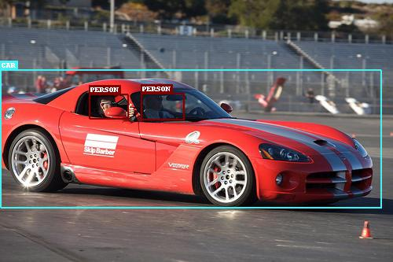

# Pytorch Implementation of SSD300 

We redesign and fix the bug in original implementation which considers `pytorch 0.4`.

This code supports `pytorch 1.0 >` in `python 3.6`.


# Objective

**To build a model that can detect and localize specific objects in images.**

<p align="center">

</p>

This repository addresses [Single Shot Multibox Detector (SSD)](https://arxiv.org/abs/1512.02325), a popular, powerful, and especially nimble network for this task. The authors' original implementation can be found [here](https://github.com/weiliu89/caffe/tree/ssd).

# Usage

## Create Data List

Before you train the model, you need to preprocess the data.  
Specify the data root in `create_data_list.py`.
```python
from utils import create_data_lists

if __name__ == '__main__':
    create_data_lists(voc07_path='[VOC2007 Datapath]', # specify your data root
                      voc12_path='[VOC2012 Datapath]',
                      output_folder='./')
```
```
python create_data_list.py
```
then, `TRAIN_images.json TEST_images.json` and `TRAIN_objects.json TEST_objects.json` files are generated.  

## Train the model

If the json files were successfully generated, you can now train the `SSD300` model.

```
python train.py 
```
We use `SGD` optimizer with `momentum=0.9` and adopt lr decay at `80000,100000` iteration.
`grad_clip` is useful if you afford to use a large batch size (_e.g., more than 32_). 
We train the model `batch_size=8` in single TITAN RTX without `grad_clip`. 

Refer to the training setting as below:

```python
# Learning parameters
checkpoint = None  # path to model checkpoint, None if none
batch_size = 8  # batch size
iterations = 120000  # number of iterations to train
workers = 4  # number of workers for loading data in the DataLoader
print_freq = 200  # print training status every __ batches
lr = 1e-3  # learning rate
decay_lr_at = [80000, 100000]  # decay learning rate after these many iterations
decay_lr_to = 0.1  # decay learning rate to this fraction of the existing learning rate
momentum = 0.9  # momentum
weight_decay = 5e-4  # weight decay
grad_clip = None  # clip if gradients are exploding, which may happen at larger batch sizes (sometimes at 32) - you will recognize it by a sorting error in the MuliBox loss calculation
```

## Test model
We provide a pre-trained model with [pre-trained model](https://drive.google.com/file/d/10ofPKSFnYMhm0Yh8IvdHBxJJhFjG1Qck/view).  
You can download it using above link or using shell file [download.sh](https://github.com/Jeffkang-94/pytorch-SSD300/blob/master/asset/download.sh)

```
cd asset
bash download.sh
```

You can detect objects based on single image using [detect.py](https://github.com/Jeffkang-94/pytorch-SSD300/blob/master/detect.py).  
Given the path of single image, you can process the object detection using pre-trained model and save the result.  
```python
if __name__ == '__main__':
    img_path = '[Path of single image]' # e.g., /mnt2/datasets/VOCdevkit/VOC2007/JPEGImages/000131.jpg
    original_image = Image.open(img_path, mode='r')
    original_image = original_image.convert('RGB')
    annotated_image = detect(original_image, min_score=0.2, max_overlap=0.5, top_k=200)
    annotated_image.save('[Name of result image]') # e.g., ./result.jpg
```
### Result Image 

<p align="center">

</p>

### Evaluation 